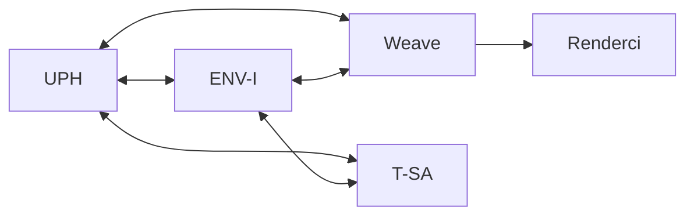

# T-Ecosystem Geliştirme Roadmap

> **Rapor Tarihi:** 23 Aralık 2024  
> **Kapsam:** Özellik geliştirme, entegrasyon iyileştirmeleri, Quality of Life  
> **Hariç Tutulan:** Mobil platform geliştirmeleri (iOS, Android, PWA)

---

## 📊 Özet Dashboard

| Uygulama   | 🔴 Kritik | 🟠 Yüksek | 🟡 Orta | 🟢 Düşük | **Toplam** |
| :--------- | :-------: | :-------: | :-----: | :------: | :--------: |
| UPH        |     2     |     5     |    8    |    4     |   **19**   |
| ENV-I      |     1     |     4     |    6    |    3     |   **14**   |
| Weave      |     2     |     6     |    5    |    3     |   **16**   |
| Renderci   |     1     |     3     |    4    |    2     |   **10**   |
| T-SA       |     1     |     4     |    5    |    2     |   **12**   |
| **Toplam** |   **7**   |  **22**   | **28**  |  **14**  |   **71**   |

---

## 📋 İçindekiler

1. [UPH (Unified Project Hub)](#1-uph-unified-project-hub)
2. [ENV-I (Envanter Yönetim Sistemi)](#2-env-i-envanter-yönetim-sistemi)
3. [Weave (Sistem Bağlantı Tasarım)](#3-weave-sistem-bağlantı-tasarım)
4. [Renderci Muhittin (3D Görselleştirme)](#4-renderci-muhittin-3d-görselleştirme)
5. [T-SA (Şartname Analiz)](#5-t-sa-şartname-analiz)
6. [Ekosistem Entegrasyonları](#6-ekosistem-entegrasyonları)
7. [Faz Planı](#7-faz-planı)
8. [Teknik Borç](#8-teknik-borç)

---

## 1. UPH (Unified Project Hub)

### 🔴 Kritik

| ID              | Başlık                   | Dosya                      | Açıklama                                          |
| :-------------- | :----------------------- | :------------------------- | :------------------------------------------------ |
| `KRİTİK-UPH-01` | ECM Store Mock Data      | `stores/ecm-store.ts`      | ECR/ECO verileri hardcoded. Firebase'e taşınmalı. |
| `KRİTİK-UPH-02` | Resource Store Mock Data | `stores/resource-store.ts` | Kapasite planlama verileri hardcoded.             |

### 🟠 Yüksek

| ID              | Başlık            | Durum                   | Aksiyon                          |
| :-------------- | :---------------- | :---------------------- | :------------------------------- |
| `YÜKSEK-UPH-01` | Gantt Şeması      | Feature tanımlı, UI yok | Proje zaman çizelgesi komponenti |
| `YÜKSEK-UPH-02` | BOM Modülü        | Feature tanımlı, UI yok | `/bom` sayfası, ürün ağacı       |
| `YÜKSEK-UPH-03` | EVM Dashboard     | Tip var, UI yok         | CPI, SPI, EAC grafikleri         |
| `YÜKSEK-UPH-04` | RAID Sayfası      | Analytics'e yönleniyor  | Bağımsız `/raid` sayfası         |
| `YÜKSEK-UPH-05` | GitHub Gerçek API | Mock fallback var       | OAuth entegrasyonu               |

### 🟡 Orta

| ID            | Başlık                 | Açıklama                                   |
| :------------ | :--------------------- | :----------------------------------------- |
| `ORTA-UPH-01` | Team Store Firebase    | Mock team data'yı Firebase'e taşı          |
| `ORTA-UPH-02` | Google Drive Gerçek    | OAuth2 flow entegrasyonu                   |
| `ORTA-UPH-03` | Proje Şablonları       | Hazır şablonlar, şablon oluşturma          |
| `ORTA-UPH-04` | Zaman Takibi           | Timer widget, haftalık timesheet           |
| `ORTA-UPH-05` | Fatura İyileştirme     | Otomatik numaralama, tekrarlayan faturalar |
| `ORTA-UPH-06` | Bildirim Sistemi       | In-app ve e-posta bildirimleri             |
| `ORTA-UPH-07` | Arama İyileştirme      | Global arama (⌘K), fuzzy search            |
| `ORTA-UPH-08` | Dashboard Özelleştirme | Widget sürükle-bırak                       |

### 🟢 Düşük (QoL)

- [ ] Klavye kısayolları (Ctrl+N, Ctrl+K, Ctrl+S)
- [ ] Bulk actions (çoklu seçim, toplu işlem)
- [ ] Export seçenekleri (PDF, Excel, CSV)
- [ ] Onboarding tour (ilk kullanıcı rehberi)

---

## 2. ENV-I (Envanter Yönetim Sistemi)

### 🔴 Kritik

| ID               | Başlık                   | Dosya                              | Açıklama                        |
| :--------------- | :----------------------- | :--------------------------------- | :------------------------------ |
| `KRİTİK-ENVI-01` | Transfer Store Kullanıcı | `stores/transfer-store.ts:200,266` | "Replace with actual user" TODO |

### 🟠 Yüksek

| ID               | Başlık                     | Dosya/Durum                     | Aksiyon                 |
| :--------------- | :------------------------- | :------------------------------ | :---------------------- |
| `YÜKSEK-ENVI-01` | Slack/E-posta Bildirimleri | `stores/alert-store.ts:310,316` | Webhook entegrasyonu    |
| `YÜKSEK-ENVI-02` | Lot Store Kullanıcı        | `stores/lot-store.ts:288`       | Auth entegrasyonu       |
| `YÜKSEK-ENVI-03` | Google Drive Gerçek        | API Key placeholder             | OAuth2 entegrasyonu     |
| `YÜKSEK-ENVI-04` | UPH Tam Entegrasyon        | Mock fallback var               | UPH Firebase bağlantısı |

### 🟡 Orta

| ID             | Başlık                  | Açıklama                         |
| :------------- | :---------------------- | :------------------------------- |
| `ORTA-ENVI-01` | Barkod Okuyucu          | Kamera, batch scanning, yazdırma |
| `ORTA-ENVI-02` | Stok Uyarı Kuralları    | Özelleştirilebilir eşikler       |
| `ORTA-ENVI-03` | Tedarikçi Değerlendirme | Puanlama, performans             |
| `ORTA-ENVI-04` | Fiziksel Sayım          | Planlı döngüler, ekip atama      |
| `ORTA-ENVI-05` | Depo Haritası 3D        | 3D görselleştirme                |
| `ORTA-ENVI-06` | Raporlama               | Özelleştirilebilir raporlar      |

### 🟢 Düşük (QoL)

- [ ] Import wizard (Excel/CSV)
- [ ] Ürün kopyalama
- [ ] Favori ürünler

---

## 3. Weave (Sistem Bağlantı Tasarım)

### 🔴 Kritik

| ID                | Başlık           | Durum               | Aksiyon                 |
| :---------------- | :--------------- | :------------------ | :---------------------- |
| `KRİTİK-WEAVE-01` | Tasarım Kaydetme | localStorage        | Firebase Storage'a taşı |
| `KRİTİK-WEAVE-02` | Google Drive     | API Key placeholder | OAuth2 entegrasyonu     |

### 🟠 Yüksek

| ID                | Başlık                    | Açıklama                           |
| :---------------- | :------------------------ | :--------------------------------- |
| `YÜKSEK-WEAVE-01` | ENV-I Gerçek Zamanlı Stok | Firebase listener ile canlı stok   |
| `YÜKSEK-WEAVE-02` | Ürün Şablonu Kaydetme     | Port yapılandırmasıyla kütüphane   |
| `YÜKSEK-WEAVE-03` | Otomatik Rota İyileştirme | Orthogonal routing, çakışma önleme |
| `YÜKSEK-WEAVE-04` | UPH Proje Bağlantısı      | Tasarımı projeye bağla             |
| `YÜKSEK-WEAVE-05` | Undo/Redo Sistemi         | Komut geçmişi, Ctrl+Z              |
| `YÜKSEK-WEAVE-06` | Multi-select ve Group     | Çoklu seçim, gruplama              |

### 🟡 Orta

| ID              | Başlık                 | Açıklama                             |
| :-------------- | :--------------------- | :----------------------------------- |
| `ORTA-WEAVE-01` | Layer Sistemi          | Katman ekleme, görünürlük, kilitleme |
| `ORTA-WEAVE-02` | Snap to Grid           | Grid hizalama, akıllı kılavuzlar     |
| `ORTA-WEAVE-03` | Annotation Araçları    | Not, boyut, referans numaraları      |
| `ORTA-WEAVE-04` | PDF Export İyileştirme | Sayfa boyutu, ölçek, watermark       |
| `ORTA-WEAVE-05` | KiCad/SPICE Export     | Gerçek format export                 |

### 🟢 Düşük (QoL)

- [ ] Dark/Light tema geçişi
- [ ] Zoom controls (fit, slider, minimap)
- [ ] Klavye kısayolları (Del, Ctrl+D, Space)

---

## 4. Renderci Muhittin (3D Görselleştirme)

### 🔴 Kritik

| ID               | Başlık                 | Durum | Aksiyon                               |
| :--------------- | :--------------------- | :---- | :------------------------------------ |
| `KRİTİK-REND-01` | Render Çıktısı Backend | Yerel | Firebase Storage, paylaşılabilir link |

### 🟠 Yüksek

| ID               | Başlık                | Açıklama                    |
| :--------------- | :-------------------- | :-------------------------- |
| `YÜKSEK-REND-01` | ENV-I Ürün Bağlantısı | Ürün seçimi, görsel çekme   |
| `YÜKSEK-REND-02` | Batch Rendering       | Çoklu dosya, kuyruk sistemi |
| `YÜKSEK-REND-03` | 3D Format Desteği     | STEP, IGES, DXF 3D          |

### 🟡 Orta

| ID             | Başlık              | Açıklama                            |
| :------------- | :------------------ | :---------------------------------- |
| `ORTA-REND-01` | Preset Özelleştirme | Özel preset oluşturma               |
| `ORTA-REND-02` | Lighting Kontrolü   | Işık kaynağı, HDRI, gölge           |
| `ORTA-REND-03` | Kamera Açıları      | Kayıtlı pozisyonlar, 360° turntable |
| `ORTA-REND-04` | Watermark/Branding  | Logo ekleme                         |

### 🟢 Düşük (QoL)

- [ ] Galeri görünümü (grid/list, filtreleme)
- [ ] Drag & drop çoklu dosya

---

## 5. T-SA (Şartname Analiz)

### 🔴 Kritik

| ID              | Başlık                   | Durum     | Aksiyon                           |
| :-------------- | :----------------------- | :-------- | :-------------------------------- |
| `KRİTİK-TSA-01` | Analiz Sonuçları Backend | IndexedDB | Firebase seçeneği, senkronizasyon |

### 🟠 Yüksek

| ID              | Başlık                      | Açıklama                      |
| :-------------- | :-------------------------- | :---------------------------- |
| `YÜKSEK-TSA-01` | ENV-I Gerçek Zamanlı        | Firebase listener, canlı stok |
| `YÜKSEK-TSA-02` | Gereksinim Tablosu Export   | Excel, PDF, UPH aktarma       |
| `YÜKSEK-TSA-03` | BOM Oluşturma               | Analiz → BOM → Weave          |
| `YÜKSEK-TSA-04` | Çoklu Döküman Karşılaştırma | Fark analizi, revizyon takibi |

### 🟡 Orta

| ID            | Başlık            | Açıklama                     |
| :------------ | :---------------- | :--------------------------- |
| `ORTA-TSA-01` | Şablon Sorgular   | Hazır soru şablonları        |
| `ORTA-TSA-02` | Analiz Geçmişi    | Arama, filtreleme, favoriler |
| `ORTA-TSA-03` | Maliyet Tahmini   | Fiyat hesaplama, teklif      |
| `ORTA-TSA-04` | Tedarikçi Önerisi | En uygun tedarikçi           |
| `ORTA-TSA-05` | PDF Annotation    | İşaretleme, notlar           |

### 🟢 Düşük (QoL)

- [ ] Sohbet geçmişi arama
- [ ] Export (Markdown, Word)

---

## 6. Ekosistem Entegrasyonları

### Merkezi Sistemler

| ID       | Başlık                | Öncelik | Açıklama                                 |
| :------- | :-------------------- | :-----: | :--------------------------------------- |
| `ECO-01` | Single Sign-On (SSO)  |   🟠    | Tek oturum açma, JWT paylaşımı           |
| `ECO-02` | Gerçek Zamanlı Sync   |   🟠    | Firebase onSnapshot, conflict resolution |
| `ECO-03` | Unified Notifications |   🟡    | Tüm uygulamalardan bildirim merkezi      |
| `ECO-04` | Global Search         |   🟡    | Tüm uygulamalarda arama                  |

### Entegrasyon Matrisi

---

## 7. Faz Planı

### Faz 1: Kritik Altyapı (2 Hafta)

> [!CAUTION]
> Bu öğeler tamamlanmadan diğer özellikler güvenilir çalışmaz.

- [ ] `KRİTİK-UPH-01`: ECM Store → Firebase
- [ ] `KRİTİK-UPH-02`: Resource Store → Firebase
- [ ] `KRİTİK-ENVI-01`: Transfer Store kullanıcı takibi
- [ ] `KRİTİK-WEAVE-01`: Tasarım kaydetme → Firebase
- [ ] `KRİTİK-TSA-01`: Analiz sonuçları → Firebase

### Faz 2: Yüksek Öncelik Özellikler (4 Hafta)

- [ ] `YÜKSEK-UPH-01`: Gantt şeması
- [ ] `YÜKSEK-UPH-02`: BOM modülü
- [ ] `YÜKSEK-ENVI-01`: Slack/E-posta bildirimleri
- [ ] `YÜKSEK-WEAVE-01`: ENV-I gerçek zamanlı stok
- [ ] `YÜKSEK-TSA-01`: ENV-I entegrasyonu
- [ ] `ECO-01`: Single Sign-On

### Faz 3: Orta Öncelik (4 Hafta)

- [ ] `YÜKSEK-UPH-03`: EVM dashboard
- [ ] `YÜKSEK-UPH-04`: RAID sayfası
- [ ] `ORTA-ENVI-05`: Depo haritası 3D
- [ ] `ORTA-WEAVE-01`: Layer sistemi
- [ ] `YÜKSEK-REND-02`: Batch rendering

### Faz 4: Quality of Life (Sürekli)

- [ ] Klavye kısayolları (tüm uygulamalar)
- [ ] UI polish ve tutarlılık
- [ ] Performance optimizasyonu
- [ ] Kullanıcı geri bildirimi döngüsü

---

## 8. Teknik Borç

> [!WARNING]
> Aşağıdaki teknik borçlar öncelikli olarak ele alınmalıdır.

| Uygulama | Borç Tipi    | Açıklama                  | Dosya(lar)                                           |
| :------- | :----------- | :------------------------ | :--------------------------------------------------- |
| UPH      | Mock Data    | 5 store'da hardcoded mock | `ecm-store.ts`, `resource-store.ts`, `team-store.ts` |
| UPH      | Deprecated   | Eski `/src/store` klasörü | `src/store/*`                                        |
| ENV-I    | Mock API     | Google Drive mock         | `google-drive-service.ts`                            |
| Weave    | localStorage | Tasarım persistence       | Canvas state                                         |
| All      | API Keys     | Hardcoded placeholder'lar | `.env` dosyaları                                     |

---

## 📈 Metrikler

| Metrik                          | Değer           |
| :------------------------------ | :-------------- |
| Toplam Geliştirme Öğesi         | 71              |
| Kritik Öğeler                   | 7               |
| Tahmini Süre (full-time, 1 dev) | 10-12 hafta     |
| Öncelik: Kritik                 | Faz 1 - 2 hafta |
| Öncelik: Yüksek                 | Faz 2 - 4 hafta |
| Öncelik: Orta                   | Faz 3 - 4 hafta |

---

> [!TIP] > **Önerilen Başlangıç:** Faz 1'deki kritik backend öğeleriyle başlayın. Bu, diğer tüm özelliklerin üzerine inşa edileceği temel altyapıyı sağlar.
